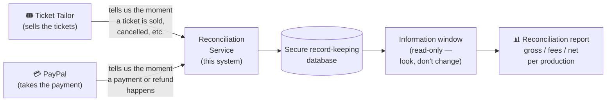
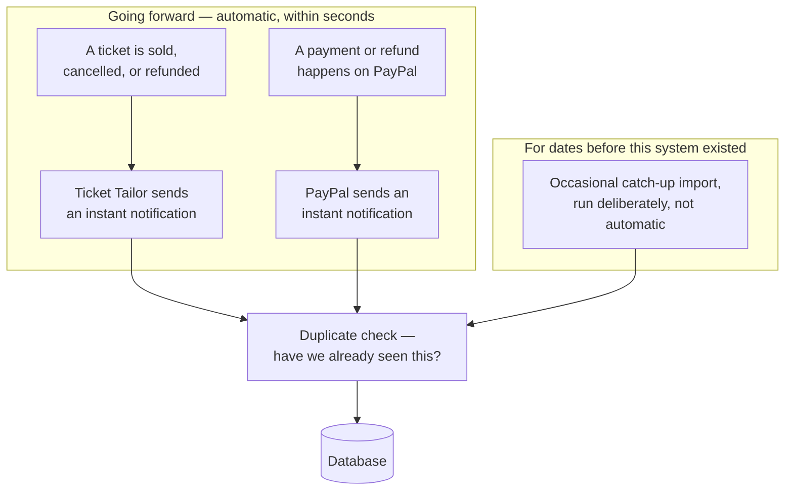
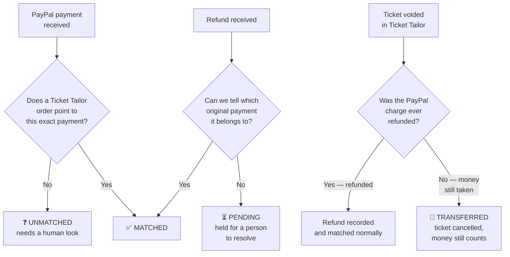

# Handover Guide

## Purpose of this document

This document exists so that if the person who built and understands this
system (the "reconciliation service") is no longer available, someone else
— not necessarily a programmer — can understand **what this system is,
why it exists, and what to do next**, whether that means keeping it running,
handing it to a hired developer, or deciding it's no longer needed.

It is written to be readable without a technical background. Wherever a
technical term is genuinely necessary, it's explained in plain English the
first time it appears, and again in the [Glossary](#glossary) near the end.

If you *are* a developer picking this up, this document is still the right
place to start for the "why" — the "how," in full technical detail, lives in
the other files in this `docs/` folder and in [`README.md`](../README.md).
Section 11, ["For whoever takes over technically,"](#11-for-whoever-takes-over-technically)
points to exactly which file covers what.

---

## Table of contents

1. [The one-paragraph summary](#1-the-one-paragraph-summary)
2. [Why this system exists](#2-why-this-system-exists)
3. [The big picture](#3-the-big-picture)
4. [How data gets in](#4-how-data-gets-in)
5. [What happens once data arrives](#5-what-happens-once-data-arrives)
6. [How the results get used](#6-how-the-results-get-used)
7. [How this relates to the ticket analytics dashboard](#7-how-this-relates-to-the-ticket-analytics-dashboard)
8. [Where this runs, and who can access it](#8-where-this-runs-and-who-can-access-it)
9. [Keeping the lights on](#9-keeping-the-lights-on)
10. [If something goes wrong](#10-if-something-goes-wrong)
11. [For whoever takes over technically](#11-for-whoever-takes-over-technically)
12. [Glossary](#glossary)

---

## 1. The one-paragraph summary

The Schauspielgruppe des Anglistischen Seminars (SSG) sells tickets through
a service called **Ticket Tailor** and takes payment through **PayPal**.
Those are two separate, unrelated companies — neither knows what the other
is doing. After every production, someone has to check that the money
PayPal actually paid out matches the tickets Ticket Tailor says were sold,
and work out the real profit (money in, minus PayPal's processing fees)
per show. This system automates that checking. It watches both Ticket
Tailor and PayPal continuously, matches payments to tickets automatically,
flags anything that doesn't add up, and makes the result available so a
report — gross income, fees taken, net profit, per production — can be
built from it.

## 2. Why this system exists

Before this system, that reconciliation work happened entirely by hand:
after each production run, someone would export a spreadsheet of ticket
sales from Ticket Tailor and a separate file of transactions from PayPal,
then manually cross-check the two, line by line, in Excel. That's slow,
easy to get subtly wrong, and depends entirely on someone knowing the
right steps and having the time to do it carefully every single time.

This system exists to do that checking automatically and consistently,
every time, without a person having to remember the process — and to keep
a permanent, checkable record of the result, rather than a one-off
spreadsheet that's hard to redo or audit later.

## 3. The big picture

Two outside companies (Ticket Tailor and PayPal) each keep their own
records and don't talk to each other. This system sits in the middle,
listens to both, works out how they line up, and keeps the definitive,
checkable answer — which anyone who needs the reconciliation report then
reads back out.

## 4. How data gets in

There are two different ways information reaches this system, and it's
worth understanding both.

### Going forward: instant automatic notifications ("webhooks")

A **webhook** is simply a message one computer system sends to another the
moment something happens — instead of someone having to log in and check.
The moment a ticket is sold, cancelled, or a PayPal payment or refund
happens, Ticket Tailor or PayPal sends this system a notification
automatically, within seconds. This is how the system stays current, day
to day, without anyone doing anything.

### For history that predates this system: "backfill"

Webhooks only start firing from the moment they're switched on — they
can't tell you about anything that happened *before* that. To get older
records (everything from before this system existed), there's a separate,
occasional catch-up process, called a **backfill**, that goes and directly
asks Ticket Tailor and PayPal for their historical records. This isn't
something that runs constantly — it's used to fill in the past once, or
to pull a specific date range when needed.

Both paths — instant notifications and the catch-up import — end up in
exactly the same place, going through exactly the same checks. Whether a
record arrived the instant it happened or was pulled in later during a
catch-up, it's treated identically from that point on.

## 5. What happens once data arrives

### Checking for duplicates

Both Ticket Tailor and PayPal can, occasionally, send the same notification
more than once (this is normal — it's how they guarantee nothing gets
lost if a message doesn't arrive the first time). This system checks
whether it has already recorded that exact ticket or payment, and if so,
ignores the repeat rather than counting it twice.

The technical term for this property — that doing something twice has the
same end result as doing it once — is **idempotency** (pronounced
eye-dem-POH-ten-cy). It's a word you're likely to run into if you or a
developer ever look through the project's technical documentation, so it's
worth knowing: an idempotent system is one that's safe to repeat, on
purpose or by accident, without ever double-counting or duplicating
anything.

### Storing the record

Once a piece of information is confirmed new, it's saved into a **database**
— think of it as a secure, structured filing cabinet, built specifically
so records can be found quickly and never silently lost or corrupted. This
is the one and only place this system keeps its records; there's no second
copy anywhere else to accidentally fall out of sync.

Personal buyer details — names, emails, phone numbers — are deliberately
**not** kept in this filing cabinet. The system only needs to know that a
ticket was sold and what it was worth, not who bought it, so that
information is stripped out before anything is saved.

### The matching (reconciliation)

This is the core of the system. In the background, it continuously compares
PayPal's payment records against Ticket Tailor's ticket records and sorts
every one into exactly one of four outcomes:

| Outcome | What it means in plain terms |
|---|---|
| **Matched** | A PayPal payment and a Ticket Tailor ticket clearly belong together. This is the normal, healthy case. |
| **Transferred** | A ticket was cancelled in Ticket Tailor, but PayPal never refunded the money — so the group keeps the income even though that specific ticket is no longer valid (for example, the audience member transferred to another performance date). |
| **Unmatched** | PayPal took a payment, but no Ticket Tailor order claims it. Worth a human looking at — it could be a data hiccup, or a sale that isn't showing up correctly. |
| **Pending** | A refund came in, but the system can't yet tell which original payment it belongs to. Rather than guessing (and risking a wrong answer in a financial report), it's held here for a person to resolve. |

This matching is deliberately **strict and exact** — it only marks two
records as belonging together when it can point to the specific shared
reference number that proves it, never an approximate guess based on
matching amounts or dates. A financial reconciliation that's occasionally
"probably right" is worse than one that says "I'm not sure" and asks a
person to check.

## 6. How the results get used

This system does not, itself, produce the final report — and that's a
deliberate design choice, not a missing feature. It is the single, trusted
source of the underlying facts (matched / unmatched / transferred /
pending, for every transaction and ticket), and it makes those facts
available through a **read-only information window** (in technical terms,
an "API" — see the [Glossary](#glossary)). "Read-only" means whatever asks
it for information can only look, never change or delete anything — which
protects the integrity of the financial record from being altered by
accident.

The actual gross/fees/net report for a production is built by a separate
report — its own, distinct piece of software — which pulls the reconciled
records for that show through this window, via the API, and totals them
up. Keeping the reporting step separate from the fact-keeping step means
there is exactly one trusted record of what actually happened, and the
report is always built fresh from it — never a second, separately-maintained
copy that could quietly drift out of step with the truth.

## 7. How this relates to the ticket analytics dashboard

SSG has a separate, older piece of software — referred to here as "the
dashboard" — that shows ticket sales analytics (trends, category
breakdowns, that sort of thing) and, historically, also did the
reconciliation this new system now handles.

**These are two different things, and it's worth being precise about the
relationship:**

- The dashboard's **ticket analytics** are not part of this project at all,
  and are not expected to become part of it. They continue to be the
  dashboard's own responsibility, separately from anything described in
  this document.
- The dashboard's **reconciliation** feature is what this system was built
  to replace. This system's matching logic was deliberately built to
  reproduce that older feature's behavior exactly, so the two could be
  compared side by side and proven equivalent before anyone trusted the
  new one.
- The intended end state is that once this system's output has been
  thoroughly checked against the dashboard's old reconciliation results,
  the dashboard's reconciliation tab is retired, and the dashboard goes
  back to doing only what it was originally for: ticket analytics.

If you're reading this because you're deciding whether the dashboard's
reconciliation feature can finally be switched off, the technical record of
that comparison and sign-off lives outside this public documentation set
(it references the dashboard's own internal code, so it's kept alongside
the project rather than published with it) — whoever has technical access
to this project's working files can locate it.

## 8. Where this runs, and who can access it

This system runs continuously on a small rented server (a "VPS" — a
computer in a data center that SSG rents, rather than owning physical
hardware). It isn't something that needs to be manually started or
stopped; it's configured to keep running and to restart itself
automatically if the server reboots.

Access to the actual financial data (the read-only information window
described in Section 6) requires a private access key, issued individually
to whoever or whatever needs to read it — a report generator, a future
dashboard integration, or a person. Keys can be issued or revoked one at a
time, so if one is ever compromised, it can be shut off without affecting
anyone else's access. There is no general public access to this data.

The full technical setup — what server software runs, how it's deployed,
and how to provision a new access key — is documented in
[`docs/DEPLOYMENT.md`](DEPLOYMENT.md) and [`docs/ENVIRONMENT.md`](ENVIRONMENT.md)
for whoever takes over the technical side.

## 9. Keeping the lights on

Two ongoing, unglamorous things matter more than anything else for keeping
this system trustworthy over time:

- **Backups.** The database (Section 5) is backed up automatically every
  night, and those backups are copied off the server itself so that losing
  the server doesn't mean losing the financial history. The full mechanism
  and how to check it's actually working are in
  [`docs/BACKUP.md`](BACKUP.md).
- **A basic health check.** The system exposes a simple "are you okay?"
  signal that a hosting or monitoring service can check automatically. If
  it stops answering, that's the first sign something needs attention.

Neither of these requires programming knowledge to understand the
*importance* of — only to actually carry out. If you're not technical
yourself, the key thing to know is: **ask whoever maintains this
technically to confirm, periodically, that backups are actually being
taken and that a restore has actually been tested** — not just assumed to
work. A backup that has never been tested is not a real safety net.

## 10. If something goes wrong

- **The reconciliation report looks wrong for a show.** Start by checking
  whether any transactions for that production are sitting in the
  "Unmatched" or "Pending" state (Section 5) — those are exactly the cases
  the system flags for a human to look at rather than guessing.
- **The system seems to have stopped updating.** Check the health signal
  mentioned in Section 9 first. If it's not responding, that's a
  technical problem needing a developer.
- **You've lost access / don't have an access key.** New keys are issued
  individually and don't require touching anything else — see
  [`docs/ENVIRONMENT.md`](ENVIRONMENT.md) for how one is generated.
- **Something needs fixing and no developer is available.** This system
  runs unattended and does not require daily intervention to keep
  operating — a gap in available development help is not, by itself, an
  emergency. The priority in that situation is simply making sure backups
  (Section 9) are still happening.

## 11. For whoever takes over technically

If you're a developer picking this project up, read
[`README.md`](../README.md) first for the technical overview, then the
rest of the `docs/` folder as needed:

| Document | Covers |
|---|---|
| [`README.md`](../README.md) | Technical overview, quick start, the read-only API |
| [`docs/ARCHITECTURE.md`](ARCHITECTURE.md) | Why the system is built the way it is — the design decisions behind storage, security, and how each provider's data is verified |
| [`docs/ENVIRONMENT.md`](ENVIRONMENT.md) | Every configuration setting, local development setup, access keys |
| [`docs/DEPLOYMENT.md`](DEPLOYMENT.md) | How and where the system is actually deployed |
| [`docs/BACKUP.md`](BACKUP.md) | The backup mechanism and its verification record |

The codebase is written in Go, a general-purpose programming language, and
stores its data in PostgreSQL, a widely-used, mature open-source database.
Both are common enough that a competent developer unfamiliar with this
specific project should be able to get productive within a few days of
reading the above.

## Glossary

- **Webhook** — a message one computer system sends to another automatically
  the moment something happens, instead of someone having to check
  manually.
- **API** ("Application Programming Interface") — a defined way for one
  piece of software to ask another for information or to tell it to do
  something. In this project, the API is **read-only**: it can be asked
  for information, but nothing that uses it can change or delete anything.
- **Backfill** — a deliberate, occasional process of pulling historical
  records directly from a provider, used for information that predates
  this system or that the automatic webhooks missed.
- **Database** — a structured, reliable place to store information so it
  can be searched and retrieved accurately; this project uses one called
  PostgreSQL.
- **Idempotency** — the property that doing something twice has the same
  end result as doing it once. It's what makes it safe for this system to
  receive the same notification more than once without double-counting
  anything.
- **Reconciliation** — the process of checking that two independent records
  of the same events (here, tickets sold and payments received) agree with
  each other, and identifying any that don't.
- **Matched / Unmatched / Transferred / Pending** — the four possible
  outcomes of reconciliation for a given transaction; see the table in
  [Section 5](#the-matching-reconciliation).
- **Gross / Fee / Net** — Gross is the full amount a buyer paid. Fee is
  what PayPal keeps for processing that payment. Net is what's left for
  SSG (gross minus fee).
- **VPS** ("Virtual Private Server") — a rented computer in a data center
  that this system runs on continuously, as opposed to physical hardware
  owned by SSG.
- **The dashboard** — SSG's separate, existing ticket-analytics tool. See
  [Section 7](#7-how-this-relates-to-the-ticket-analytics-dashboard) for
  exactly how it relates to this project.
